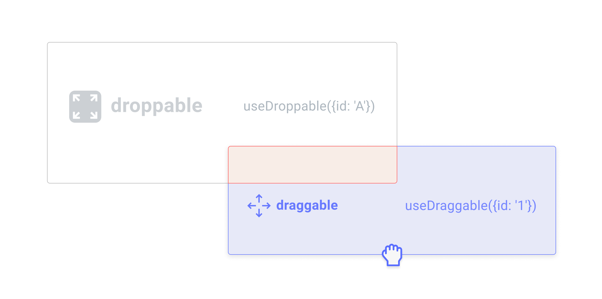
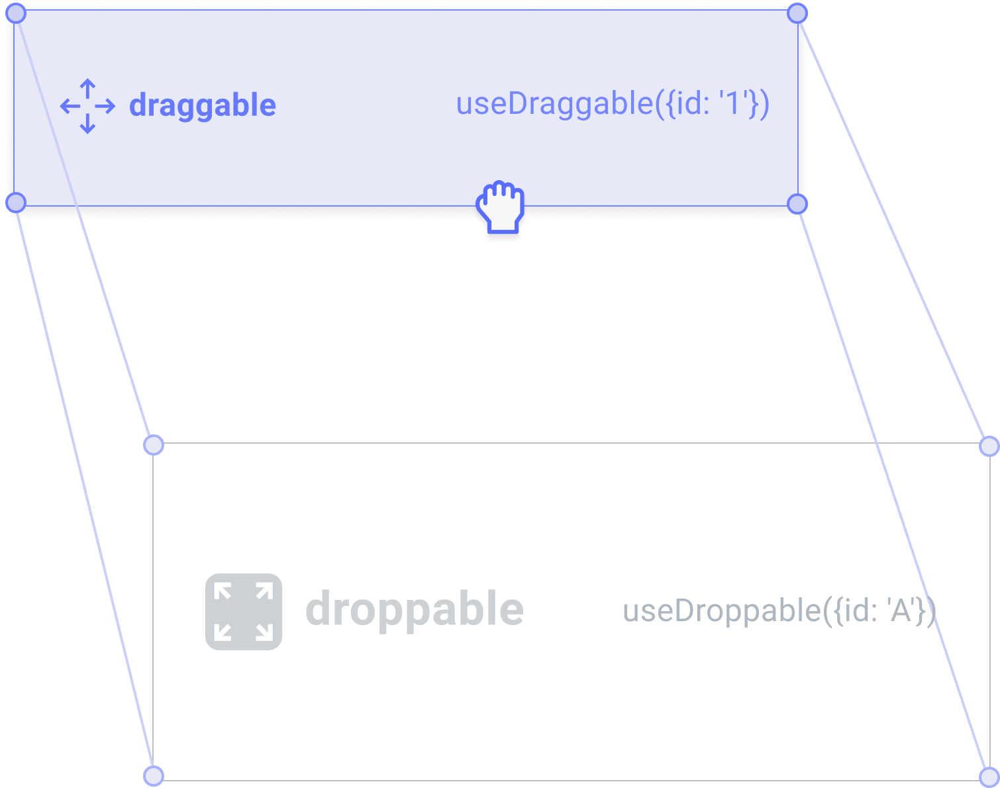

# DndContext

In order for your your [Droppable](../droppable.md) and [Draggable](../draggable/) components to interact with each other, you'll need to make sure that the part of your React tree that uses them is nested within  a parent `<DndContext>` component, which makes use of the [React Context API](https://reactjs.org/docs/context.html) to share data between draggable and droppable components and hooks.

> React context provides a way to pass data through the component tree without having to pass props down manually at every level.

## Application structure

```jsx
import React from 'react';
import {DndContext} from '@dnd-kit/core';

function App() {
  return (
    <DndContext>
      /* Your components that use `useDraggable`,
       * `useDroppable` or `DraggableClone` will need
       * to be nested within here.
       *
       * They don't need to be direct descendants, but
       * there does need to be a parent <DndContext>
       * somewhere higher up in the tree.
       * 
       * You can also nest <DndContext> providers within
       * other <DndContext> to achieve nested draggable
       * UIs that are independent of one another.
       */
    </DndContext>
  );
}
```

## Props

```typescript
interface Props {
  autoScroll?: boolean;
  announcements?: Announcements;
  children?: React.ReactNode;
  collisionDetection?: CollisionDetection;
  screenReaderInstructions?: ScreenReaderInstructions;
  sensors?: SensorDescriptor<any>[];
  translateModifiers?: Modifiers;
  onDragStart?(event: DragStartEvent): void;
  onDragMove?(event: DragMoveEvent): void;
  onDragOver?(event: DragOverEvent): void;
  onDragEnd?(event: DragEndEvent): void;
  onDragCancel?(): void;
}
```

## Events

As you can see from the list of props above, there's a number of different events you can subscribe to and different customizations you can pass to `<DndContext>`.

The main events you can subscribe to are:

* `onDragStart`: Fires when a drag event that meets the [activation constraints]() for that [sensor ](../sensors/)happens.
* `onDragMove`:  Fires anytime as the draggable item is moved. Depending on the activated sensor, this could for example be as mouse is moved or the keyboard movement keys are pressed.
* `onDragOver`:  Fires anytime a draggable item is moved over a droppable container, along with the unique identifier of that droppable container.
* `onDragEnd`:  Fires after a draggable item is dropped. This event 
* `onDragCancel`: Fires if a drag operation is cancelled, for example, if the user presses `escape` while dragging a draggable.

## Collision detection algorithms

### Rectangle intersection

By default, `DndContext` uses the rectangle intersection collision detection strategy. This means that in order for a draggable item to be considered **over** a droppable area, there needs to be an intersection between both rectangles:



### Closest center

While the rectangle intersection strategy is well suited for most drag and drop use cases, it can be unforgiving, since it requires both the draggable and droppable bounding rectangles to come into direct contact and intersect.

For some use cases, such as sortable lists, using a more forgiving collision detection strategy is recommended. 

As its name suggests, the closest center strategy finds the droppable container who's center is closest to  the center of the bounding rectangle of the active draggable item.


### Closest corners

Similarly to the closest center algorithm, the closest corner algorithm doesn't require the draggable and droppable rectangles to intersect.

Rather, it measures the distance between all four corners of the active draggable item and the four corners of each droppable container to find the closest one. 

The distance is measured from the top left corner of the draggable item to the top left corner of the droppable bounding rectangle, top right to top right, bottom left to bottom left, and bottom right to bottom right. 



