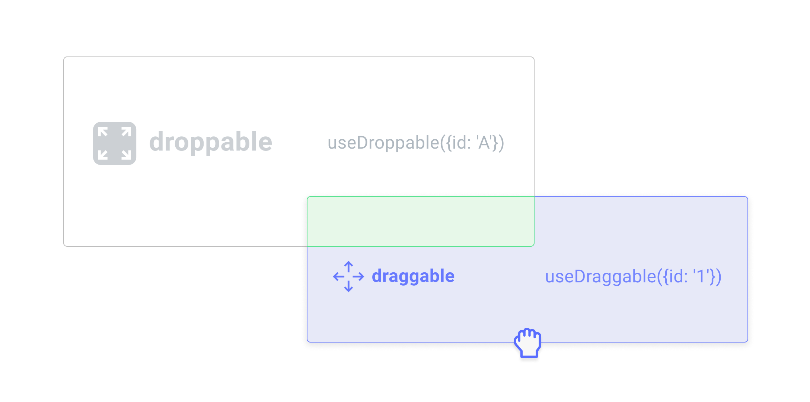
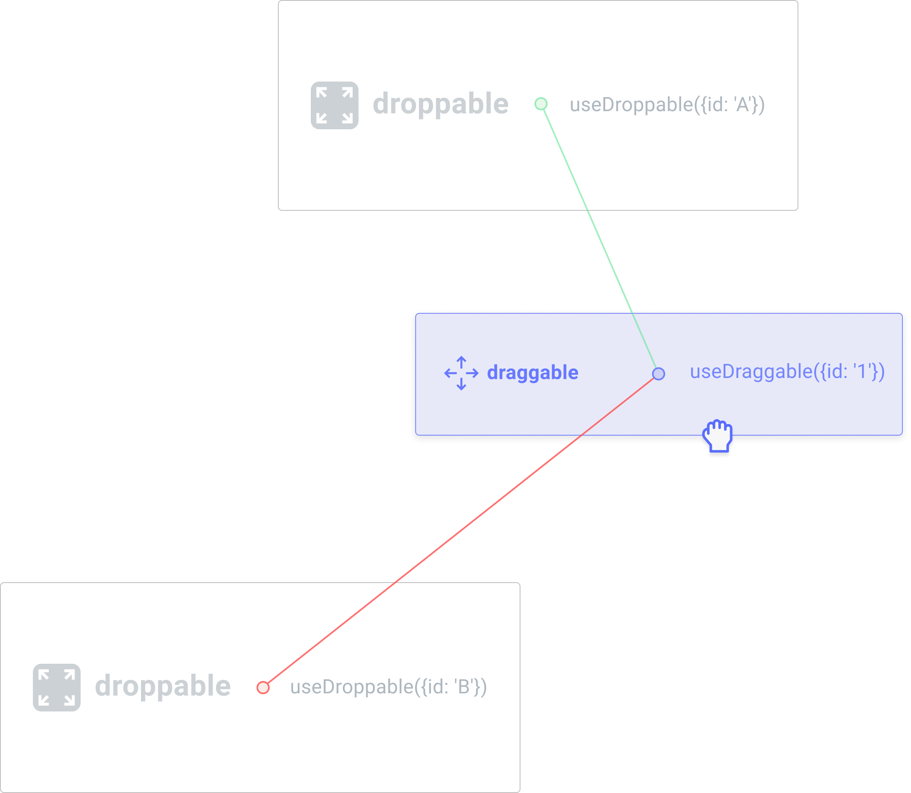
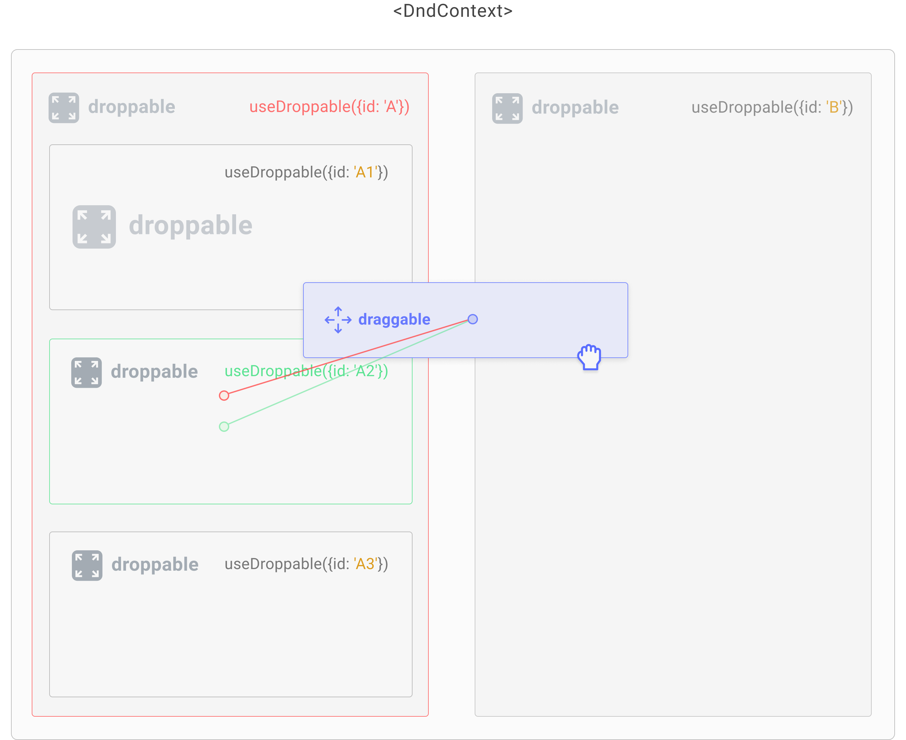
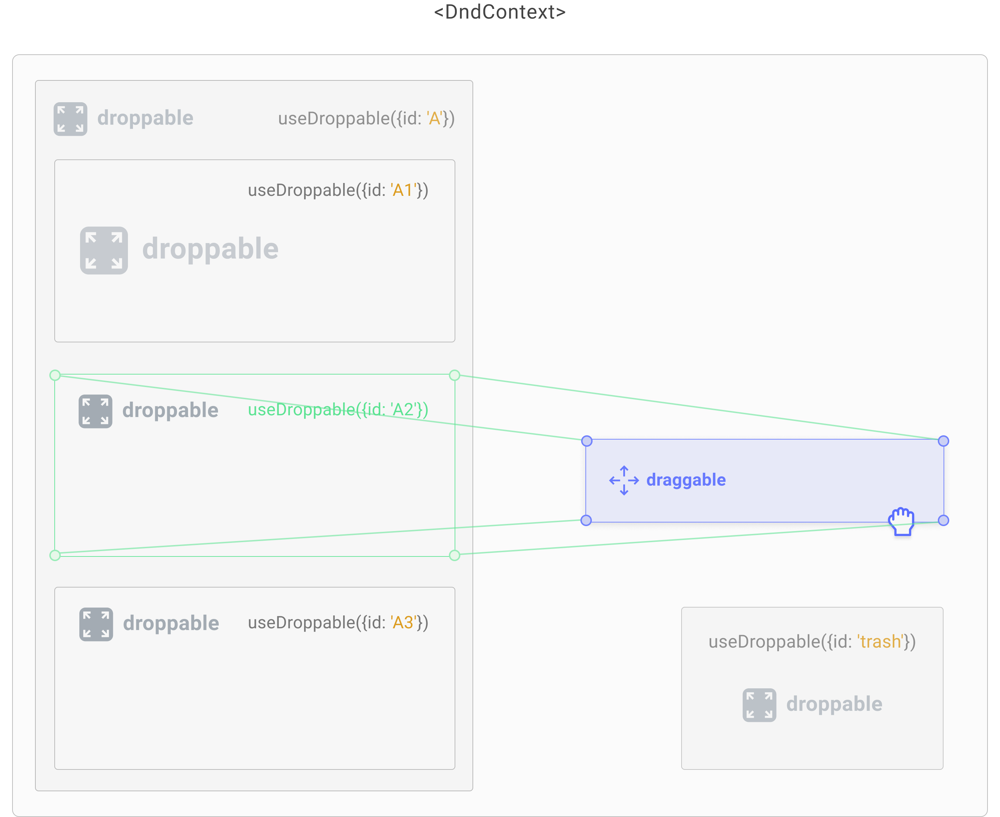
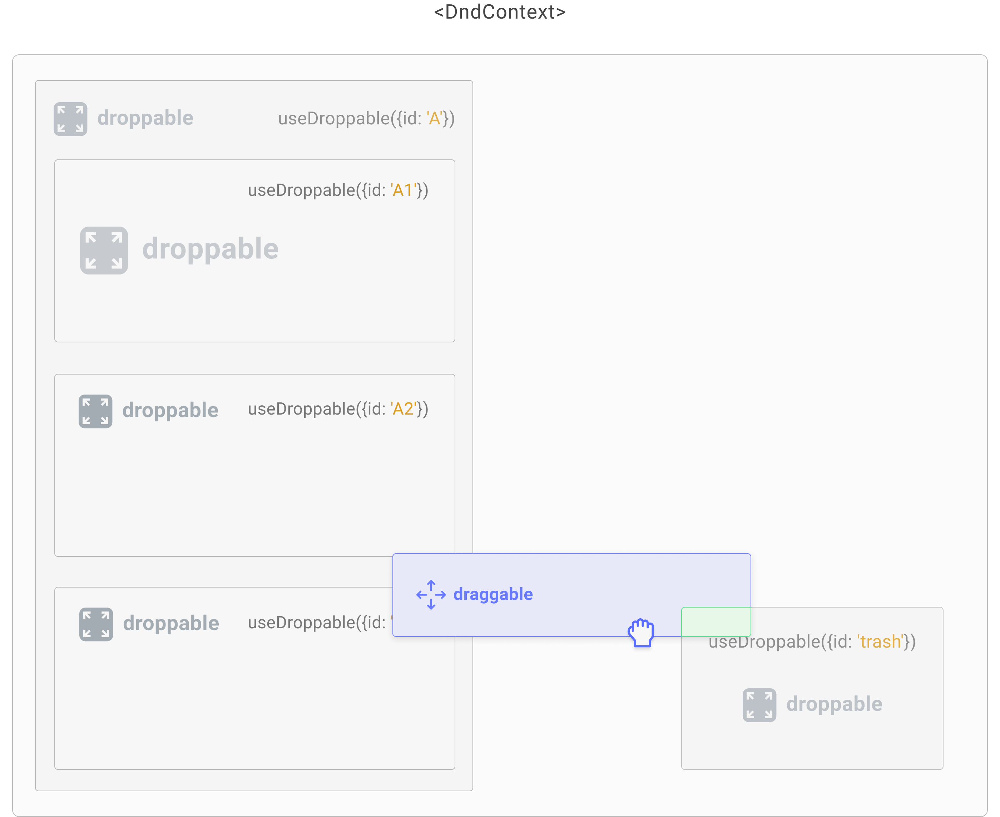

# Collision detection algorithms

If you're familiar with how 2D games are built, you may have come across the notion of collision detection algorithms.

One of the simpler forms of collision detection is between two rectangles that are axis aligned — meaning rectangles that are not rotated. This form of collision detection is generally referred to as [Axis-Aligned Bounding Box](https://developer.mozilla.org/en-US/docs/Games/Techniques/2D\_collision\_detection#Axis-Aligned\_Bounding\_Box) (AABB).

The built-in collision detection algorithms assume a rectangular bounding box.

> The bounding box of an element is the smallest possible rectangle (aligned with the axes of that element's user coordinate system) that entirely encloses it and its descendants.\
> – Source: [MDN](https://developer.mozilla.org/en-US/docs/Glossary/bounding\_box)

This means that even if the draggable or droppable nodes look round or triangular, their bounding boxes will still be rectangular:


If you'd like to use other shapes than rectangles for detecting collisions, build your own [custom collision detection algorithm](collision-detection-algorithms.md#custom-collision-detection-strategies).

## Rectangle intersection

By default, [`DndContext`](./) uses the **rectangle intersection** collision detection algorithm.&#x20;

The algorithm works by ensuring there is no gap between any of the 4 sides of the rectangles. Any gap means a collision does not exist.

This means that in order for a draggable item to be considered **over** a droppable area, there needs to be an intersection between both rectangles:



## Closest center

While the rectangle intersection algorithm is well suited for most drag and drop use cases, it can be unforgiving, since it requires both the draggable and droppable bounding rectangles to come into direct contact and intersect.

For some use cases, such as [sortable](../../presets/sortable/) lists, using a more forgiving collision detection algorithm is recommended.&#x20;

As its name suggests, the closest center algorithm finds the droppable container who's center is closest to  the center of the bounding rectangle of the active draggable item:



## Closest corners

Like to the closest center algorithm, the closest corner algorithm doesn't require the draggable and droppable rectangles to intersect.

Rather, it measures the distance between all four corners of the active draggable item and the four corners of each droppable container to find the closest one.&#x20;


The distance is measured from the top left corner of the draggable item to the top left corner of the droppable bounding rectangle, top right to top right, bottom left to bottom left, and bottom right to bottom right.&#x20;

### **When should I use the closest corners algorithm instead of closest center?**

In most cases, the **closest center** algorithm works well, and is generally the recommended default for sortable lists because it provides a more forgiving experience than the **rectangle intersection algorithm**.

In general, the closest center and closest corners algorithms will yield the same results. However, when building interfaces where droppable containers are stacked on top of one another, for example, when building a Kanban, the closest center algorithm can sometimes return the underlaying droppable of the entire Kanban column rather than the droppable areas within that column.&#x20;



In those situations, the **closest corners** algorithm is preferred and will yield results that are more aligned with what the human eye would predict:


## Pointer within

As its name suggests, the pointer within collision detection algorithm only registers collision when the pointer is contained within the bounding rectangle of other droppable containers.

This collision detection algorithm is well suited for high precision drag and drop interfaces.


As its name suggests, this collision detection algorithm **only works with pointer-based sensors**. For this reason, we suggest you use [composition of collision detection algorithms](collision-detection-algorithms.md#composition-of-existing-algorithms) if you intend to use the `pointerWithin` collision detection algorithm so that you can fall back to a different collision detection algorithm for the Keyboard sensor.


## Custom collision detection algorithms

In advanced use cases, you may want to build your own collision detection algorithms if the ones provided out of the box do not suit your use case.

You can either write a new collision detection algorithm from scratch, or compose two or more existing collision detection algorithms.

### Composition of existing algorithms

Sometimes, you don't need to build custom collision detection algorithms from scratch. Instead, you can compose existing collision algorithms to augment them.

A common example of this is when using the `pointerWithin` collision detection algorithm. As its name suggest, this collision detection algorithm depends on pointer coordinates, and therefore does not work when using other sensors like the Keyboard sensor. It's also a very high precision collision detection algorithm, so it can sometimes be helpful to fall back to a more tolerant collision detection algorithm when the `pointerWithin` algorithm does not return any collisions.

```javascript
import {pointerWithin, rectIntersection} from '@dnd-kit/core';

function customCollisionDetectionAlgorithm(args) {
  // First, let's see if there are any collisions with the pointer
  const pointerCollisions = pointerWithin(args);
  
  // Collision detection algorithms return an array of collisions
  if (pointerCollisions.length > 0) {
    return pointerCollisions;
  }
  
  // If there are no collisions with the pointer, return rectangle intersections
  return rectIntersection(args);
};
```

Another example where composition of existing algorithms can be useful is if you want some of your droppable containers to have a different collision detection algorithm than the others.&#x20;

For instance, if you were building a sortable list that also supported moving items to a trash bin, you may want to compose both the `closestCenter` and `rectangleIntersection` collision detection algorithms.





From an implementation perspective, the custom intersection algorithm described in the example above would look like:

```javascript
import {closestCorners, rectIntersection} from '@dnd-kit/core';

function customCollisionDetectionAlgorithm({
  droppableContainers,
  ...args,
}) {
  // First, let's see if the `trash` droppable rect is intersecting
  const rectIntersectionCollisions = rectIntersection({
    ...args,
    droppableContainers: droppableContainers.filter(({id}) => id === 'trash')
  });
  
  // Collision detection algorithms return an array of collisions
  if (rectIntersectionCollisions.length > 0) {
    // The trash is intersecting, return early
    return rectIntersectionCollisions;
  }
  
  // Compute other collisions
  return closestCorners({
    ...args,
    droppableContainers: droppableContainers.filter(({id}) => id !== 'trash')
  });
};
```

### Building custom collision detection algorithms

For advanced use cases or to detect collision between non-rectangular or non-axis aligned shapes, you'll want to build your own collision detection algorithms.

Here's an example to [detect collisions between circles](https://developer.mozilla.org/en-US/docs/Games/Techniques/2D\_collision\_detection#Circle\_Collision) instead of rectangles:

```javascript
/**
 * Sort collisions in descending order (from greatest to smallest value)
 */
export function sortCollisionsDesc(
  {data: {value: a}},
  {data: {value: b}}
) {
  return b - a;
}

function getCircleIntersection(entry, target) {
  // Abstracted the logic to calculate the radius for simplicity
  var circle1 = {radius: 20, x: entry.offsetLeft, y: entry.offsetTop};
  var circle2 = {radius: 12, x: target.offsetLeft, y: target.offsetTop};

  var dx = circle1.x - circle2.x;
  var dy = circle1.y - circle2.y;
  var distance = Math.sqrt(dx * dx + dy * dy);

  if (distance < circle1.radius + circle2.radius) {
    return distance;
  }

  return 0;
}

/**
 * Returns the circle that has the greatest intersection area
 */
function circleIntersection({
  collisionRect,
  droppableRects,
  droppableContainers,
}) => {
  const collisions = [];

  for (const droppableContainer of droppableContainers) {
    const {id} = droppableContainer;
    const rect = droppableRects.get(id);

    if (rect) {
      const intersectionRatio = getCircleIntersection(rect, collisionRect);

      if (intersectionRatio > 0) {
        collisions.push({
          id,
          data: {droppableContainer, value: intersectionRatio},
        });
      }
    }
  }

  return collisions.sort(sortCollisionsDesc);
};
```

To learn more, refer to the implementation of the built-in collision detection algorithms.
