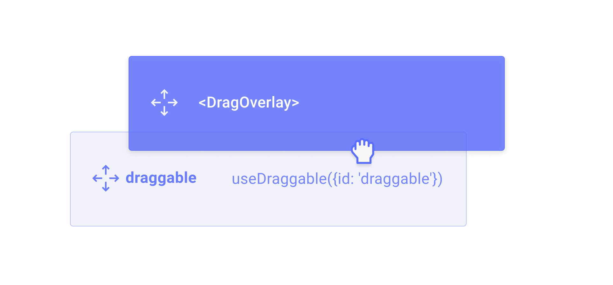

# Drag Overlay

The `<DragOverlay>` component provides a way to render a draggable overlay that is removed from the normal document flow and is positioned relative to the viewport.



## When should I use a drag overlay?

Depending on your use-case, you may want to use a drag overlay rather than transforming the original [draggable](./) source:

* If you'd like to show a preview of where the draggable source will be when dropped, you can update the position of the draggable source while dragging without affecting the drag overlay.
* If your item needs to move from one container to another while dragging, we highly recommend you use the [`<DragOverlay>`](drag-overlay.md) component so the item can move more freely from one container to another. You'll also be able to get smooth drop animations when using the drag overlay.
* If your draggable item is within a scrollable container, we also recommend you use a `<DragOverlay>`, otherwise you'll need to set the draggable element to `position: fixed` yourself so the item isn't restricted to the overflow and stacking context of its scroll container, and can move without being affected by the scroll position of its container.

## Usage




```jsx
import React, {useState} from 'react';
import {DndContext, DragOverlay} from '@dnd-kit/core';

import {Draggable} from './Draggable';

/* The implementation details of <Item> and <ScrollableList> are not
 * relevant for this example and are therefore omitted. */

function App() {
  const [items] = useState(['1', '2', '3', '4', '5']);
  const [activeId, setActiveId] = useState(null);
  
  return (
    <DndContext onDragStart={handleDragStart} onDragEnd={handleDragEnd}>
      <ScrollableList>
        {items.map(id =>
          <Draggable key={id} id={id}>
            <Item value={`Item ${id}`} />
          </Draggable>
        )}
      </ScrollableList>
      
      <DragOverlay>
        {activeId ? (
          <Item value={`Item ${activeId}`} /> 
        ): null}
      </DragOverlay>
    </DndContext>
  );
  
  function handleDragStart(event) {
    setActiveId(event.active.id);
  }
  
  function handleDragEnd() {
    setActiveId(null);
  }
}
```



```jsx
import React from 'react';
import {useDraggable} from '@dnd-kit/core';

function Draggable(props) {
  const {attributes, listeners, setNodeRef} = useDraggable({
    id: props.id,
  });
  
  return (
    <li ref={setNodeRef} {...listeners} {...attributes}>
      {props.children}
    </li>
  );
}
```



In this example, whenever a draggable item is picked up, we render a drag overlay that can move freely outside of the `<ScrollableList>` and isn't constrained to it's overflow or stacking context.

