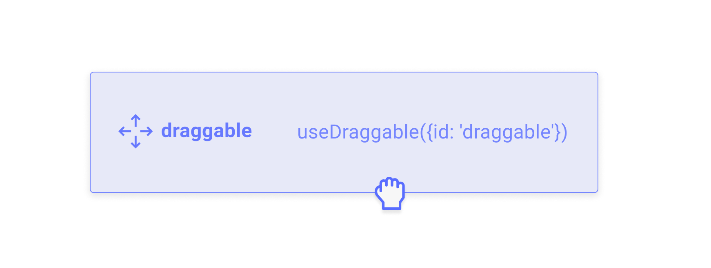

# useDraggable



## Arguments

```typescript
interface UseDraggableArguments {
  id: string;
  disabled?: boolean;
  attributes?: {
    role?: string;
    roleDescription?: string;
    tabIndex?: number;
  },
}
```

### Identifier

The `id` argument is a string that should be a unique identifier, meaning there should be no other **draggable** elements that share that same identifier within a given [`DndContext`](../context-provider/) provider.

If you're building a component that uses both the `useDraggable` and `useDroppable` hooks, they can both share the same identifier since draggable elements are stored in a different key-value store than droppable elements.

### Disabled

Since hooks cannot be conditionally invoked, use the `disabled` argument and set it to `true` if you need to temporarily disable a `draggable` element.

### Attributes

The default values for the `attributes` property are sensible defaults that should cover a wide range of use cases, but there is no one-size-fits-all solution.

You know your application best, and we encourage you to manually attach only the attributes that you think make sense in the context of your application rather than using them all without considering whether it makes sense to do so. 

For example, if the HTML element you are attaching the `useDraggable` `listeners` to is already a native HTML `button` element, although it's harmless to do so, there's no need to add the `role="button"` attribute, since that is already the default role of `button`. 

#### Role

The ARIA `"role"` attribute lets you explicitly define the role for an element, which communicates its purpose to assistive technologies.

The default value for the `"role"` attribute is `"button"`. 


If it makes sense in the context of what you are building, we recommend that you leverage the native HTML `<button>` element for draggable elements.


#### Role description

The `roleDescription` argument can be used to tailor the screen reader experience to your application. For example, if you're building a sortable list of products you'd want to set the `roleDescription` value to something like `"sortable product"`.

**Tab index**

The `tabindex` attribute dictates the order in which focus moves throughout the document.

* Natively interactive elements such as buttons \(`button`\), anchor \(`a`\) tags and form controls have a default `tabindex` value of `0`. 
* Custom elements that are intended to be interactive and receive keyboard focus need to have an explicitly assigned `tabindex="0"`\(for example, `div` and `li` elements\)

In other words, in order for your draggable elements to receive keyboard focus, they _need_ to have the `tabindex` attribute set to `0` if they are not natively interactive elements \(such as the HTML `button` element\).

For this reason, the `useDraggable` hook sets the `tabindex="0"` attribute by default.

## Properties

```typescript
{
  active: {
    id: UniqueIdentifier;
    node: React.MutableRefObject<HTMLElement>;
  } | null;
  activeRect: PositionalClientRect | null;
  attributes: {
    role: string;
    'aria-pressed': boolean;
    'aria-roledescription': string;
    'aria-describedby': string;
  },
  clientRects: PositionalClientRectMap;
  isDragging: boolean;
  listeners: Record<SyntheticListenerName, Function> | undefined;
  node: React.MutableRefObject<HTMLElement | null>;
  over: {id: UniqueIdentifier} | null;
  setNodeRef(HTMLElement | null): void;
  transform: {x: number, y: number, scaleX: number, scaleY: number} | null;
}
```

