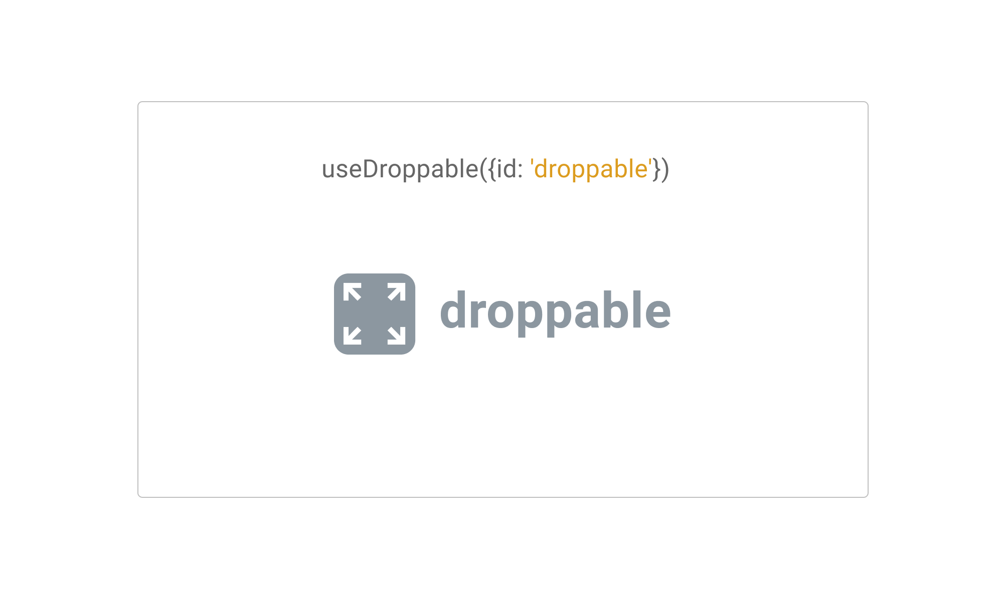

# useDroppable



## Arguments

```typescript
interface UseDroppableArguments {
  id: string;
  disabled?: boolean;
  data?: Record<string, any>;
}
```

### Identifier

The `id` argument is a string that should be a unique identifier, meaning there should be no other **droppable** elements that share that same identifier within a given [`DndContext`](../context-provider/) provider.

If you're building a component that uses both the `useDroppable` and `useDraggable` hooks, they can both share the same identifier since droppable elements are stored in a different key-value store than draggable elements.

### Disabled

Since [hooks cannot be conditionally invoked](https://reactjs.org/docs/hooks-rules.html), use the `disabled` argument and set it to `true` if you need to temporarily disable a `droppable` area.

### Data

The `data` argument is for advanced use-cases where you may need access to additional data about the droppable element in custom sensors, presets or collision detection algorithm. 

For example, if you were building a sortable preset, you could use the `data` attribute to store the index of the droppable element within a sortable list to access it within a custom sensor.

```jsx
  const {setNodeRef} = useDroppable({
    id: props.id,
    data: {
      index: props.index,
    }
  });
```

## Properties

```typescript
{
  rect: React.MutableRefObject<LayoutRect | null>;
  isOver: boolean;
  node: React.RefObject<HTMLElement>;
  over: {id: UniqueIdentifier} | null;
  setNodeRef(element: HTMLElement | null): void;
}
```

### Node

#### `setNodeRef`

In order for the `useDroppable` hook to function properly, it needs the `setNodeRef` property to be attached to the HTML element you intend on turning into a droppable area:

```jsx
function Droppable(props) {
  const {setNodeRef} = useDroppable({
    id: props.id,
  });
  
  return (
    <div ref={setNodeRef}>
      {/* ... */}
    </div>
  );
}
```

#### `node`

A [ref](https://reactjs.org/docs/refs-and-the-dom.html) to the current node that is passed to `setNodeRef`

#### `rect`

For advanced use cases, if you need the bounding rect measurement of the droppable area.

### Over

#### `isOver`

Use the `isOver` boolean returned by the `useDroppable` hook to change the appearance or content displayed when a `draggable` element is dragged over your droppable container. 

#### `over`

If you'd like to change the appearance of the droppable in response to a draggable being dragged over a different droppable container, check whether the `over` value is defined. Depending on your use-case, you can also read the `id` of the other droppable that the draggable item to make changes to the render output of your droppable component.

#### 

