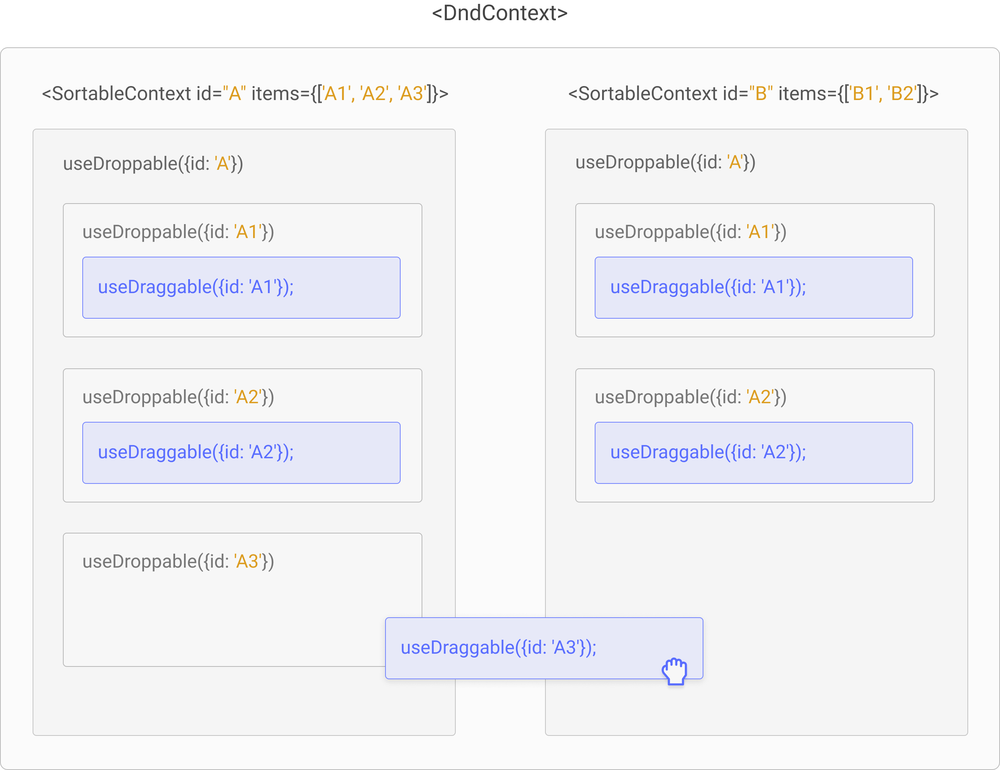

# Sortable

The sortable preset provides the building blocks to build a sortable interface.

## Installation

To get started, install the sortable preset via `npm` or `yarn`:  

```bash
npm install @dnd-kit/sortable
```

## Overview

The sortable preset builds on top of the primitives exposed by `@dnd-kit/core` to help building sortable interfaces. The sortable preset exposes two main concepts: `SortableContext`, and the `useSortable` hook. 

The `useSortable` hook is an abstraction that composes the `useDroppable` and `useDraggable` hooks. 

At a high level, if we look beneath the surface of the `useSortable` hook, the application structure looks as follows:


## Sortable Context

In addition to the [drag and drop context provider](../../guides/getting-started.md#context-provider),  the Sortable preset requires its own context provider that contains the sorted array of the unique identifiers associated to each sortable item:  

```javascript
import React, {useState} from 'react';
import {DndContext} from '@dnd-kit/core';
import {SortableContext} from '@dnd-kit/sortable';

function App() {
  const [items] = useState(['1', '2', '3']);

  return (
    <DndContext>
      <SortableContext items={items}>
        {/* ... */}
      </SortableContext>
    </DndContext>
  );
}
```


In order for the `SortableContext` component to function properly, make sure it is a descendant of a `DndContext` component. You may nest multiple `SortableContext` components within the same parent `DndContext`.


## useSortable

The `useSortable` hook combines both the `useDraggable` and `useDroppable` hooks to connect elements as both draggable sources and drop targets.

```javascript
import {useSortable} from '@dnd-kit/sortable';
import {CSS} from '@dnd-kit/utilities';

function SortableItem(props) {
  const {
    attributes,
    listeners,
    setNodeRef,
    transform,
    transition,
  } = useSortable({id: props.id});
  
  const style = {
    transform: CSS.Transform.toString(transform),
    transition,
  };
  
  return (
    <div ref={setNodeRef} style={style} {...attributes} {...listeners}>
      {/* ... */}
    </div>
  );
}
```

For more details on the `useSortable` hook, read the full [API documentation](usesortable.md).

## Sensors

The sortable preset ships with an augmented version of the keyboard sensor that is optimized for the use case of sortable lists. To use it, simply import the `useSortableSensors` hook provided by `@dnd-kit/sortable`

```jsx
import {SortableContext, useSortableSensors} from '@dnd-kit/sortable';

function App() {
  const [items] = useState(['1', '2', '3']);
  const sensors = useSortableSensors();

  return (
    <DndContext sensors={sensors}>
      <SortableContext items={items}>
        {/* ... */}
      </SortableContext>
    </DndContext>
  );
}
```

By default, `useSortableSensors` uses the [Keyboard](../../api-documentation/sensors/keyboard.md) and [Pointer](../../api-documentation/sensors/pointer.md) sensors. If you'd like to configure the keyboard sensor, you can do so by passing options directly to `useSortableSensors`:

```javascript
useSortableSensors({
  keyboardSensorOptions: {
    scrollBehavior: 'auto',
  }
})
```

If you'd like to configure the Pointer sensor, or use the Mouse and Touch sensors, initialize those sensors separately with the options you'd like to use and pass those as the second argument to `useSortableSensors`:

```javascript
import {MouseSensor, TouchSensor, useSensor} from '@dnd-kit/core';
import {SortableContext, useSortableSensors} from '@dnd-kit/sortable';

function App() {
  const [items] = useState(['1', '2', '3']);
  const mouseSensor = useSensor(MouseSensor, {
    // Require the mouse to move by 10 pixels before activating
    activationConstraint: {
      distance: 10,
    },
  });
  const touchSensor = useSensor(TouchSensor, {
    // Press delay of 250ms, with tolerance of 5px of movement
    activationConstraint: {
      delay: 250,
      tolerance: 5,
    },
  });
  const sensors = useSortableSensors({}, [mouseSensor, touchSensor]);
  
  return (
    <DndContext sensors={sensors}>
      <SortableContext items={items}>
        {/* ... */}
      </SortableContext>
    </DndContext>
  );
}
```

## Sorting strategies

The supported use cases of the Sortable preset include vertical lists, horizontal lists, grids, and virtualized lists. Because of the wide variety of use cases supported, it would be difficult to write a single strategy to cover all of these different use cases. Instead, the sortable preset exposes a number of different strategies you can use, that are tailored to these various use cases:

* `rectSortingStrategy`:  This is the default value, and is suitable for most use cases. This strategy does not support virtualized lists.
* `verticalListSortingStrategy`: This strategy is optimized for vertical lists, and supports virtualized lists.
* `horizontalListSortingStrategy`: This strategy is optimized for horizontal lists, and supports virtualized lists.
* `rectSwappingStrategy`: Use this strategy to achieve swappable functionality.

Make sure to use the sorting strategy that is the most adapted to the use case you are building for.

In this example, we'll be building a vertical sortable list, so we will be using the `verticalListSortingStrategy`. Make sure to pass the strategy both to `SortableContext` and to `useSortableSensors`:

```javascript
import {
  SortableContext,
  useSortableSensors,
  verticalListSortingStrategy,
} from '@dnd-kit/sortable';

function App() {
  const [items] = useState(['1', '2', '3']);
  const sensors = useSortableSensors({
    strategy: verticalListSortingStrategy,
  });

  return (
    <DndContext sensors={sensors}>
      <SortableContext items={items} strategy={verticalListSortingStrategy}>
        {/* ... */}
      </SortableContext>
    </DndContext>
  );
}
```

## Connecting all the pieces


Along with the sensors,  we will be setting up the event handlers for the `DndContext` component, and the SortableContainer component to calculate our layout.

```jsx
import {
  arrayMove,
  SortableContainer,
  useSortableSensors,
  verticalListSortingStrategy,
} from '@dnd-kit/sortable';
import {closestRect, DndContext, restrictToWindowEdges} from '@dnd-kit/core';
import {restrictToVerticalAxis} from '@dnd-kit/modifiers';
import React, {useState} from 'react';

const VerticalSortableList = () => {
  const [items, setItems] = useState(['item #1', 'item #2', 'item #3']);

  // We store which item is currentrly being dragged
  const [activeId, setActiveId] = useState(null);

  const sensors = useSortableSensors({strategy: verticalListSortingStrategy});

  // We constraint the item movement to be only vertical and inside
  const translateModifiers = [restrictToVerticalAxis, restrictToWindowEdges];

  const handleDragStart = ({active}) => {
    if (!active) {
      return;
    }

    // We set the active id in our state
    setActiveId(active.id);
  };

  const getIndex = items.indexOf.bind(items);
  const activeIndex = activeId ? getIndex(activeId) : -1;

  const handleDragEnd = ({over}) => {
    // When the drag is over, we look for the active item new position
    // and move it accordingly
    if (over) {
      const overIndex = getIndex(over.id);
      if (activeIndex !== overIndex) {
        setItems((items) => arrayMove(items, activeIndex, overIndex));
      }
    }

    // Reset the state
    setActiveId(null);
  };

  return (
    <DndContext
      sensors={sensors}
      collisionDetection={closestRect}
      onDragStart={handleDragStart}
      onDragEnd={handleDragEnd}
      onDragCancel={() => setActiveId(null)}
      translateModifiers={translateModifiers}
    >
      <SortableContainer id="container" items={items}>
        {/* Sortable list */}
      </SortableContainer>
    </DndContext>
  );
};

export default VerticalSortableList;

```

## Multiple containers



