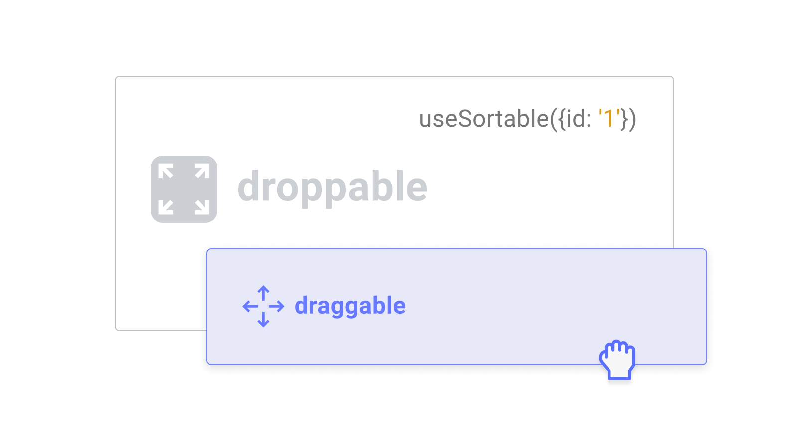
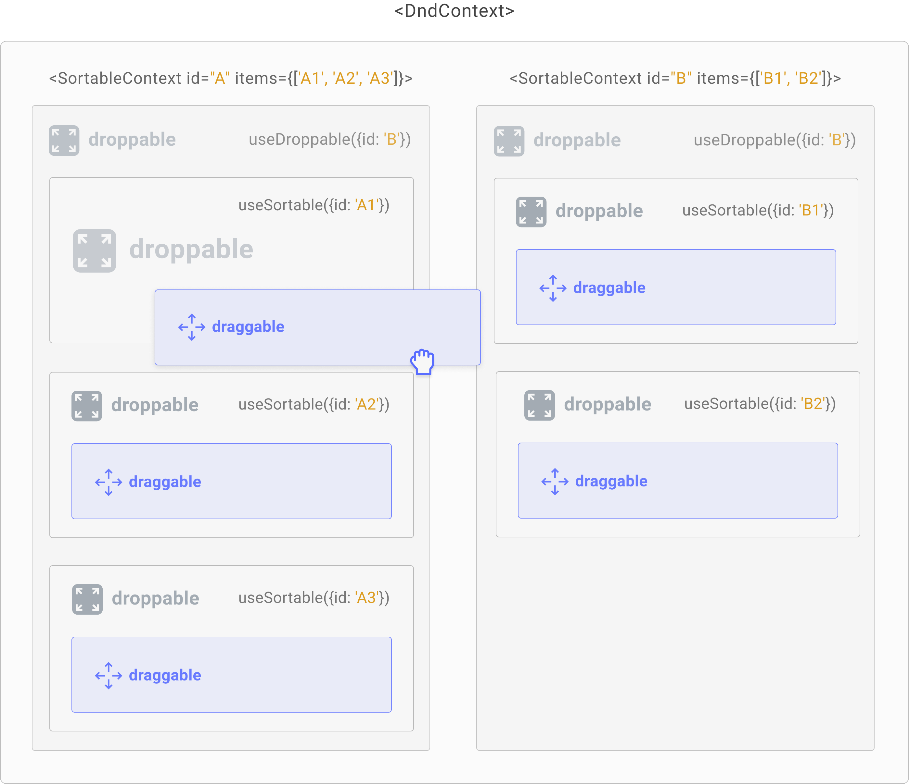

# Sortable

## Installation

To get started, install the sortable preset via `npm` or `yarn`:  

```bash
npm install @dnd-kit/sortable
```

## Overview

The sortable preset builds on top of the primitives exposed by `@dnd-kit/core` to help building sortable interfaces. The sortable preset exposes two main concepts: [~~`SortableContext`~~](./#sortable-context), and the [`useSortable`](./#usesortable) hook. 

The `SortableContext` provides information via context that is consumed by the `useSortable` hook.

The `useSortable` hook is an abstraction that composes the [`useDroppable`](../../api-documentation/droppable.md) and [`useDraggable`](../../api-documentation/draggable/) hooks:



### Single container

At a high level, the application structure to implement a **sortable list with a single container** looks as follows:


### Multiple containers

To implement sortable list with items that can be dropped within **multiple containers**, the application structure is the same, but we add as many `SortableContexts` as we have containers:



In this example, we would use the `onDragOver` callback of `DndContext` to detect when a draggable element is moved over a different container to insert it in that new container while dragging. 

If you paid close attention to the illustration above, you may also have noticed that we added a droppable zone around each sortable context. This isn't required, but will likely be the behaviour most people want. If you move all sortable items from one column into the other, you will need a droppable zone for the empty column so that you may drag sortable items back into that empty column:


## Concepts

### Sortable Context

In addition to the [drag and drop context provider](../../guides/getting-started.md#context-provider),  the Sortable preset requires its own context provider that contains the **sorted** array of the unique identifiers associated to each sortable item:

```jsx
import React, {useState} from 'react';
import {DndContext} from '@dnd-kit/core';
import {SortableContext} from '@dnd-kit/sortable';

function App() {
  const [items] = useState(['1', '2', '3']);

  return (
    <DndContext>
      <SortableContext items={items}>
        {/* ... */}
      </SortableContext>
    </DndContext>
  );
}
```

The `SortableContext` provides information via context that is consumed by the `useSortable` hook, which is covered in greater detail in the next section.  

It does not expose any callback props. To know when a sortable \(draggable\) item is being picked or moved over another sortable \(droppable\) item, use the callback props of `DndContext`:

```jsx
import React, {useState} from 'react';
import {DndContext} from '@dnd-kit/core';
import {SortableContext} from '@dnd-kit/sortable';

function App() {
  const [items] = useState(['1', '2', '3']);

  return (
    <DndContext onDragEnd={handleDragEnd}>
      <SortableContext items={items}>
        {/* ... */}
      </SortableContext>
    </DndContext>
  );
  
  function handleDragEnd() {}
}
```


In order for the `SortableContext` component to function properly, make sure it is a descendant of a `DndContext` provider. You may nest multiple `SortableContext` components within the same parent `DndContext`.


### useSortable

As outlined above, the `useSortable` hook combines both the [`useDraggable`](../../api-documentation/draggable/) and [`useDroppable`](../../api-documentation/droppable.md) hooks to connect elements as both draggable sources and drop targets:



In most cases, the draggable and droppable hooks will be attached to the same node, and therefore be identical in size. They are represented as different nodes for illustration purposes above.


If you're already familiar with the [`useDraggable`](../../api-documentation/draggable/) hook, the `useSortable` hook should look very familiar, since, it is an abstraction on top of it. 

In addition to the `attributes`, `listeners`,`transform`  and `setNodeRef` arguments, which you should already be familiar with if you've used the `useDraggable` hook before, you'll notice that the `useSortable` hook also provides a `transition` argument.

```jsx
// SortableItem.jsx

import {useSortable} from '@dnd-kit/sortable';
import {CSS} from '@dnd-kit/utilities';

function SortableItem(props) {
  const {
    attributes,
    listeners,
    setNodeRef,
    transform,
    transition,
  } = useSortable({id: props.id});
  
  const style = {
    transform: CSS.Transform.toString(transform),
    transition,
  };
  
  return (
    <div ref={setNodeRef} style={style} {...attributes} {...listeners}>
      {/* ... */}
    </div>
  );
}
```

The default transition is `250` milliseconds, with an easing function set to `ease`, but you can customize this and pass any valid [CSS transition timing function](https://developer.mozilla.org/en-US/docs/Web/CSS/transition-timing-function), or set the transition argument to `null` to disable transitions entirely:

```javascript
const {
  transition,
} = useSortable({
  id: props.id,
  transition: {
    duration: 150, // milliseconds
    easing: 'cubic-bezier(0.25, 1, 0.5, 1)',
  },
});
```

For more details on the `useSortable` hook, read the full [API documentation](usesortable.md).

### Sensors

Sensors are an abstraction to manage and listen to different input methods. If you're unfamiliar with the concept of sensors, we recommend you read the [introduction to sensors](../../api-documentation/sensors/) first. 

The sortable preset ships with an augmented version of the keyboard sensor that is optimized for the use case of sortable lists. 

To use it, import the `useSortableSensors` hook provided by `@dnd-kit/sortable`:

```jsx
import {SortableContext, useSortableSensors} from '@dnd-kit/sortable';

function App() {
  const [items] = useState(['1', '2', '3']);
  const sensors = useSortableSensors();

  return (
    <DndContext sensors={sensors}>
      <SortableContext items={items}>
        {/* ... */}
      </SortableContext>
    </DndContext>
  );
}
```

By default, `useSortableSensors` uses the [Keyboard](../../api-documentation/sensors/keyboard.md) and [Pointer](../../api-documentation/sensors/pointer.md) sensors. If you'd like to configure the keyboard sensor, you can do so by passing options directly to `useSortableSensors`:

```javascript
useSortableSensors({
  keyboardSensorOptions: {
    scrollBehavior: 'auto',
  }
})
```

If you'd like to configure the Pointer sensor, or use the Mouse and Touch sensors instead, initialize those sensors separately with the options you'd like to use and pass those as the second argument to `useSortableSensors`:

```jsx
import {MouseSensor, TouchSensor, useSensor} from '@dnd-kit/core';
import {SortableContext, useSortableSensors} from '@dnd-kit/sortable';

function App() {
  const [items] = useState(['1', '2', '3']);
  const mouseSensor = useSensor(MouseSensor, {
    // Require the mouse to move by 10 pixels before activating
    activationConstraint: {
      distance: 10,
    },
  });
  const touchSensor = useSensor(TouchSensor, {
    // Press delay of 250ms, with tolerance of 5px of movement
    activationConstraint: {
      delay: 250,
      tolerance: 5,
    },
  });
  const sensors = useSortableSensors({}, [mouseSensor, touchSensor]);
  
  return (
    <DndContext sensors={sensors}>
      <SortableContext items={items}>
        {/* ... */}
      </SortableContext>
    </DndContext>
  );
}
```

To learn more about sensors, read the detailed documentation on sensors:



### Sorting strategies

The supported use cases of the Sortable preset include vertical lists, horizontal lists, grids, and virtualized lists. Because of the wide variety of use cases supported, it would be difficult to write a single strategy to cover all of these different use cases. Instead, the sortable preset exposes a number of different strategies you can use, that are tailored to these various use cases:

* `rectSortingStrategy`:  This is the default value, and is suitable for most use cases. This strategy does not support virtualized lists.
* `verticalListSortingStrategy`: This strategy is optimized for vertical lists, and supports virtualized lists.
* `horizontalListSortingStrategy`: This strategy is optimized for horizontal lists, and supports virtualized lists.
* `rectSwappingStrategy`: Use this strategy to achieve swappable functionality.

Make sure to use the sorting strategy that is the most adapted to the use case you are building for.

### Collision detection algorithm

The default collision detection algorithm of `DndContext` is the [rectangle intersection](../../api-documentation/context-provider/#rectangle-intersection) algorithm. While the rectangle intersection strategy is well suited for many use cases, it can be unforgiving, since it requires both the draggable and droppable bounding rectangles to come into direct contact and intersect.

For sortable lists, we recommend using a more forgiving collision detection strategy such as the [closest center](../../api-documentation/context-provider/#closest-center) or [closest corner](../../api-documentation/context-provider/#closest-corners) algorithms. 

In this example, we'll be using the closest center algorithm:

```jsx
import {
  closestCenter,
  SortableContext, 
  useSortableSensors
} from '@dnd-kit/sortable';

function App() {
  const [items] = useState(['1', '2', '3']);
  const sensors = useSortableSensors();

  return (
    <DndContext sensors={sensors} collisionDetection={closestCenter}>
      <SortableContext items={items}>
        {/* ... */}
      </SortableContext>
    </DndContext>
  );
}
```

## Connecting all the pieces

First, let's go ahead and render all of our sortable items:



```jsx
import {
  closestCenter,
  SortableContext,
  useSortableSensors,
} from '@dnd-kit/sortable';


import {SortableItem} from './SortableItem.jsx';

function App() {
  const [items] = useState(['1', '2', '3']);
  const sensors = useSortableSensors();

  return (
    <DndContext sensors={sensors} collisionDetection={closestCenter}>
      <SortableContext items={items}>
        {items.map(id => <SortableItem key={id} id={id} />)}
      </SortableContext>
    </DndContext>
  );
}
```



```jsx
import {useSortable} from '@dnd-kit/sortable';
import {CSS} from '@dnd-kit/utilities';

function SortableItem(props) {
  const {
    attributes,
    listeners,
    setNodeRef,
    transform,
    transition,
  } = useSortable({id: props.id});
  
  const style = {
    transform: CSS.Transform.toString(transform),
    transition,
  };
  
  return (
    <div ref={setNodeRef} style={style} {...attributes} {...listeners}>
      {/* ... */}
    </div>
  );
}
```



In this example, we'll be building a vertical sortable list, so we will be using the `verticalListSortingStrategy`. Make sure to pass the strategy both to `SortableContext` and to `useSortableSensors`:

```jsx
import {
  closestCenter,
  SortableContext,
  useSortableSensors,
  verticalListSortingStrategy,
} from '@dnd-kit/sortable';

import {SortableItem} from './SortableItem.jsx';

function App() {
  const [items] = useState(['1', '2', '3']);
  const sensors = useSortableSensors({
    strategy: verticalListSortingStrategy,
  });

  return (
    <DndContext sensors={sensors} collisionDetection={closestCenter}>
      <SortableContext 
        items={items}
        strategy={verticalListSortingStrategy}
      >
        {items.map(id => <SortableItem key={id} id={id} />)}
      </SortableContext>
    </DndContext>
  );
}
```

Finally, we'll need to set up event handlers on the `DndContext` provider in order to update the order of the items on drag end.

```jsx
import {
  arrayMove,
  closestCenter,
  SortableContext,
  useSortableSensors,
  verticalListSortingStrategy,
} from '@dnd-kit/sortable';

import {SortableItem} from './SortableItem.jsx';

function App() {
  const [items, setItems] = useState(['1', '2', '3']);
  const sensors = useSortableSensors({
    strategy: verticalListSortingStrategy,
  });

  return (
    <DndContext 
      sensors={sensors}
      collisionDetection={closestCenter}
      onDragEnd={handleDragEnd}
    >
      <SortableContext 
        items={items}
        strategy={verticalListSortingStrategy}
      >
        {items.map(id => <SortableItem key={id} id={id} />)}
      </SortableContext>
    </DndContext>
  );
  
  function handleDragEnd(event) {
    const {active, over} = event;
    
    if (active.id !== over.id) {
      setItems((items) => {
        const oldIndex = items.indexOf(active.id);
        const newIndex = items.indexOf(over.id);
        
        return arrayMove(items, oldIndex, newIndex);
      });
    }
  }
}
```

